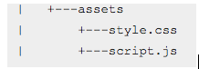
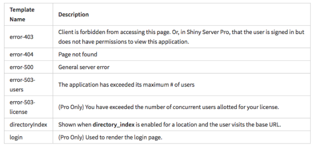
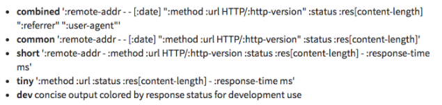

*Below guide is for handling Shiny Server Configuration, note that using
the previous guide you would have an Ubuntu VM on an Amazon EC2
Instance*

*See :
[*http://docs.rstudio.com/shiny-server/*](http://docs.rstudio.com/shiny-server/)
for more information*

**List of Shiny Server commands (Ubuntu-specific):**

-   **sudo start shiny-server:** Starts Shiny Server

-   **sudo stop shiny-server:** Stops/Ends Shiny Server

-   **sudo reload shiny-server:** Reloads the configuration of the Shiny
    > Server but doesn’t restart the server or any Shiny processes

-   **status shiny-server:** Checks status or gets process id for the
    > Shiny Server

**Default Configuration:**

*Configuration file is usually installed at
**/etc/shiny-server/shiny-server.conf** if it doesn’t already exist*

*Note that comments are written using the **\# symbol** and are not
parsed when configuring the server*

Below are default configuration file contents:

> \# Define the user we should use when spawning R Shiny processes\
> run\_as shiny;\
> \
> \# Define a top-level server which will listen on a port\
> server {\
> \# Instruct this server to listen on port 3838\
> listen 3838;\
> \
> \# Define the location available at the base URL\
> location / {\
> \#\#\#\# PRO ONLY \#\#\#\#\
> \# Only up tp 20 connections per Shiny process and at most 3 Shiny
> processes\
> \# per application. Proactively spawn a new process when our processes
> reach\
> \# 90% capacity.\
> utilization\_scheduler 20 .9 3;\
> \#\#\#\# END PRO ONLY \#\#\#\#\
> \
> \# Run this location in 'site\_dir' mode, which hosts the entire
> directory\
> \# tree at '/srv/shiny-server'\
> site\_dir /srv/shiny-server;\
> \
> \# Define where we should put the log files for this location\
> log\_dir /var/log/shiny-server;\
> \
> \# Should we list the contents of a (non-Shiny-App) directory when the
> user\
> \# visits the corresponding URL?\
> directory\_index on;\
> }\
> }\
> \
> \
> \# Setup a flat-file authentication system. {.pro}\
> auth\_passwd\_file /etc/shiny-server/passwd;\
> \
> \# Define a default admin interface to be run on port 4151. {.pro}\
> admin 4151 {\
> \# Only permit the user named \`admin\` to access the admin
> interface.\
> required\_user admin;\
> }

Shiny Server can be configured to host multiple servers on different
ports/hostnames. Each server has locations that can serve Shiny Apps
and/or static assets. Individual apps can also override settings applied
to their parent location.

Note that the above configuration will create a single server listening
on port 3838 and serves any app contained within **/srv/shiny-server**
at the root URL (/).

This configuration creates an admin dashboard interface located on port
4151 (Use your-public-ec2-instance-address:4151 to access). To access
this you need to create a new user called admin using the below command

> sudo /opt/shiny-server/bin/sspasswd /etc/shiny-server/passwd admin

and then enter and verify the password you wish to use for this user.
Note that passwd is an empty database for user authentication and
passwords.

**Configuration/Server Specifics:**

-   server: Defines an HTTP Server that listens on the port defined

> server {\
> listen 80;\
> }

-   location: Defines how a particular URL path should be served

> server {\
> ...\
> \# Define the location '/specialApp'\
> location /specialApp {\
> \# Run this location in 'app\_dir' mode, which will host a single
> Shiny\
> \# Application available at '/srv/shiny-server/myApp'\
> app\_dir /srv/shiny-server/myApp\
> }\
> \
> \# Define the location '/otherApps'\
> location /otherApps {\
> \# Run this location in 'site\_dir' mode, which hosts the entire
> directory\
> \# tree at '/srv/shiny-server/apps'\
> site\_dir /srv/shiny-server/apps;\
> }\
> ...\
> }

Note the 4 hosting models Shiny Server supports through the below
methods:

**site\_dir:** Hosts entire directory tree (both Shiny Apps & static
assets) based on the directory that you defined, to access each of these
use [*http://your-server.com/assets*](http://your-server.com/assets) for
the below example:

{width="2.15625in"
height="0.7291666666666666in"}

If inside the directory you serving has the directory assets.

**app\_dir:** Serves a single application defined at given directory

**user\_dirs:** Allows users on system to create and manage their own
Shiny apps

> run\_as :HOME\_USER:;\
> \
> \# Define the root location\
> location / {\
> user\_dirs;\
> \
> \# Only allow members of the 'shinyUsers' group to host personal
> applications.\
> members\_of shinyUsers;\
> }

The above means that only members of shinyUsers can publicly host any
Shiny application available in the user's \~/ShinyApps directory. For
instance, if a user named tina who is a member of the shinyUsers group,
has /home/tina as a home directory, and has an application called
shinyApp1 in /home/tina/ShinyApps/, that application would be available
on this server at the URL http://server.com/tina/shinyApp1. Any other
application in /home/tina/ShinyApps/ would also be publically available
at a similar URL.

**redirect:** redirects to a specified URL, use 301 for permanent
redirect or 302 for temporary redirect and final option is whether or
not to use exact matching using a boolean.

> \# Define a location at the base URL of this 'server'\
> location / {\
> \# Redirect traffic from '/shinyApp1/' to 'http://server.com'
> temporarily.\
> location /shinyApp1 {\
> redirect "http://server.com" 302 true;\
> }\
> }

-   run\_as: Determines which user should spawn the Shiny processes as
    > the paths in which R looks for packages (in .libPath) is
    > user-dependent

> location / {\
> run\_as tim;\
> }

Will run as user tim and run all of tim’s relevant .libPath

Also R processes are spawned using the Bash login shell, so that
anything including commands or any environment variables that are stored
below will be available to the R processes:

> /etc/profile
>
> \~/.bash\_profile\
> \~/.bash\_login\
> \~/.profile

You can also run using special instances of a run\_as user using the
below:

**:HOME\_USER:** Runs as the user in whose home directory the app exists
in, so if the app is stored in jim’s directory would run as jim. You
should also provide an additional username as a fallback user just in
case

> run\_as :HOME\_USER: shiny;\
> \
> ...\
> \
> location /users {\
> user\_dirs;\
> }\
> \
> location /apps {\
> site\_dir /srv/shiny-server;\
> log\_dir /var/log/shiny-server;\
> directory\_index on;\
> }

**:AUTH\_USER:** Available in ShinyServer Pro, runs apps as whatever
user the visitor to the app is logged in as/authenticated as. If user
not logged in, this setting has no effect and next user in the run\_as
chain will be used

> run\_as :HOME\_USER: :AUTH\_USER: shiny;

So above, if not authenticated, then uses the shiny fallback user

**PAM Sessions & Authentication: \[For Pro users\]**

Shiny Servers uses PAM (Pluggable Authentication Modules) for user
authentication as well to establish the resources available for R
sessions. PAM and its API is provided by Linux and PAM authentication
can determine when users should be allowed to log in and PAM Sessions
set constraints on a Shiny process that a user may spawn. PAM profiles
are located in **/etc/pam.d.**

Note that by default, PAM authenticates using the system user database:
/etc/passwd but can be used to authenticate using Active Directory
and/or LDAP.

Shiny Server requires the same kind of behaviour associated with **su**
or a user without a password. And be default, it uses **/etc/pam.d/su**
which has default behaviour depending on the version of Linux and local
configuration. However you would likely want to create a custom profile
for Shiny sessions, so for example if you want to use a profile called
shiny-session, you add the below to the configuration file:

> pam\_sessions\_profile shiny-session;

Then you would create in a **/etc/pam.d/shiny-session** the below
information for your custom profile:

> \# This allows root to su without passwords (this is required) {.pro}\
> auth sufficient pam\_rootok.so\
> \
> \# This module parses environment configuration file(s) {.pro}\
> \# and also allows you to use an extended config {.pro}\
> \# file /etc/security/pam\_env.conf. {.pro}\
> \# parsing /etc/environment needs "readenv=1" {.pro}\
> session required pam\_env.so readenv=1\
> \
> \# Locale variables are also kept in /etc/default/locale in etch
> {.pro}\
> \# reading this file \*in addition to /etc/environment\* does not hurt
> {.pro}\
> session required pam\_env.so readenv=1 envfile=/etc/default/locale\
> \
> \# Enforces user limits defined in /etc/security/limits.conf {.pro}\
> session required pam\_limits.so\
> \
> \# The standard Unix authentication
>
> modules {.pro}\
> @include common-auth\
> @include common-account\
> @include common-session

Use this to learn more about Linux PAM module:
[*http://www.linux-pam.org/Linux-PAM-html/Linux-PAM\_SAG.html*](http://www.linux-pam.org/Linux-PAM-html/Linux-PAM_SAG.html)

-   r\_path: Certain R dependencies may require certain versions of R
    > and you can install multiple versions of R on a server for
    > different applications

-   allow\_app\_override: Allows local app configurations instead

-   server\_name: lets specific apps only run when receiving requests
    > from a specific url such as if you define server\_name: server.com
    > then you would only accept requests from server.com

**Custom Templates:**

For defining custom html templates to be served for special cases like a
403 error not found page, handlebar templates need to be saved in
**etc/shiny-server/templates/.** All file have to follow the **error-**
convention with html file format like below:

{width="6.5in" height="3.013888888888889in"}

Use the line:

> template\_dir /etc/shiny-server/templates;

In your configuration file to inform where templates are stored.

Templates are cached and thus immediate changes might not be seen. Note
that only HTML templates generate using Shiny Server is rendered, HTML
templates from Shiny are not rendered.

**Custom Headers:**

You can set custom headers for HTTP responses using similar syntax as
below:

> set\_header "Strict-Transport-Security" "max-age=36000";

**Server Logs:**

All info related to Shiny Server is logged into Global System log
located in **/var/log/shiny-server.log.**

You can also use an access log configured using the access\_log
parameter like below:

> access\_log /var/log/shiny-server/access.log tiny;

There are 5 logging formats allowed:

{width="6.5in" height="1.5277777777777777in"}

**Environment Variables**

Have to restart the Shiny Server to apply the new changes to the
environment variables

These are the below environment variables to be set:

-   **SHINY\_LOG\_LEVEL:** Defines verbosity of logging from TRACE,
    > DEBUG, INFO, WARN, and ERROR

-   **R:** Defines path to R executable

-   **SHINY\_DATA\_DIR:** Defines where Shiny Server should persist the
    > data to disk

> Shiny Server expects a directory called **monitor/rrd/** in
> SHINY\_DATA\_DIR. By default, Shiny Server creates and stores data in
> /var/lib/shiny-server/.

**Deploying Apps:**

For an app, a scheduler is responsible for fulfilling incoming requests
to a particular app. The scheduler can be specified at any location in
configuration file, inner nested app configurations can inherit and all
apps will have an associated scheduler.

You can restart an app by typing **touch restart.txt** and altering the
modified time on the file.

-   Simple Scheduler: It associates a single R process with a single
    > Shiny application. This scheduler accepts a single parameter which
    > specifies the maximum number of concurrent sessions. Once this
    > number is reached, users attempting to create a new session on
    > this application will receive a 503 error page.

> \# Define a new location at the base URL\
> location / {\
> \# Define the scheduler to use for this location\
> simple\_scheduler 15;\
> \
> ...\
> }

-   Utilization Scheduler: In Shiny Server Pro, a Shiny App can run
    > multiple processes, process are auto-redirected to the process
    > with the fewest connections. This scheduler is configured by three
    > parameters.

<!-- -->

-   maxRequestsPerProc -- The number of concurrent connections that a
    > single R process can support before it will begin to return 503
    > errors for new sessions. The default is 20.

-   loadFactor -- The "trigger percentage" (on a scale from 0 to 1) at
    > which a new R process should be spawned. Once session capacity
    > reaches this percentage, a new process will be spawned (unless the
    > maxProc limit has been reached). The default is 0.9.

-   maxProc -- The maximum number of processes associated with this
    > Shiny application that should exist concurrently. Note that this
    > does not include restarted versions of the same application in its
    > count. The default is 3.

> location /shinyApp1 {\
> \# Define the scheduler to use for this application\
> utilization\_scheduler 5 0.5 3;\
> \
> ...\
> }

Above example creates a max of 3 processes, a max of 5
connections/process and 0.5 load factor.

-   App Timeout: Shiny Apps have values for timeouts, which will close
    > connections:

    -   **app\_init\_timeout** → Describes the amount of time (in
        > seconds) to wait for an application to start. Default value is
        > 60 seconds.

    -   **app\_idle\_timeout** → Defines the amount of time (in seconds)
        > an R process with no active connections should remain open.
        > After the last connection disconnects from an R process, this
        > timer will start and, after the specified number of seconds,
        > if no new connections have been created, the R process will be
        > killed. The default value for app\_idle\_timeout is 5 seconds.

    -   **App\_session\_timeout →** This setting accepts a single value
        > that dictates the number of seconds after which an idle
        > session will be disconnected**.** Default value is 0, which
        > means that sessions will never be automatically disconnected.

-   Logging & Analytics:

    -   For locations set with **user\_dirs**, these logs are created in
        > each user's \~/ShinyApps/log/ directory

    -   For locations configured with **app\_dir** or **site\_dir**, the
        > directory in which these logs are created is managed by the
        > **log\_dir** setting, which can be specified globally, for a
        > particular server, or for a particular location.

    -   The log files will be created in the following format:

> &lt;application directory name&gt;-YYYMMDD-HHmmss-&lt;port number or
> socket ID&gt;.log

-   Reactivity Logs: The reactivity log is a browser-based tool for
    > analyzing and debugging reactive dependencies in a Shiny
    > Application. Therefore, this feature should be used in a fresh R
    > session in which only one Shiny application is active. To enable
    > the reactivity log, run the command options(shiny.reactlog=TRUE)
    > before running your application. Once you've started your
    > application and are viewing it in a browser, you can use Ctrl+F3
    > (or Command+F3 for Mac users) to view the reactivity log.

-   Protocols: Shiny Server provides nine different methods of
    > connecting to the server in real-time. In order of preference,
    > they are:

1.  WebSocket

2.  XDR Streaming

3.  XHR Streaming

4.  iframe Eventsource

5.  iframe HTML File

6.  XDR Pollilng

7.  XHR Polling

8.  iframe XHR Polling

9.  JSONP Polling

> Shiny Server keeps moving down the list for fallback if the protocol
> before doesn’t exist. Shiny Server uses SockJS to facilitate
> communication between the browser and the server. However, some
> environments have found consistent problems with having particular
> protocols enabled, and find that a particular protocol or set of
> protocols are most reliable in their environment. In this case, you
> can use the disable\_protocols setting to disable any of the available
> protocols. For instance, if you find that WebSockets and XDR polling
> are problematic on your networking equipment, you could add the
> following configuration to disable them:
>
> disable\_protocols websocket xdr-polling;

-   Authentication: For Pro Only, Shiny Server Professional offers the
    > ability to authenticate individual users. By specifying
    > authentication requirements on particular servers or locations,
    > the administrator can control the set of applications particular
    > users are allowed to access.

> Authentication can be implemented by integrating into an existing LDAP
> or Active Directory database, relying on Google accounts, or by using
> a "flat-file" authentication system that is contained in a local file.
> To ensure that your users' passwords are being protected, it is
> strongly encouraged that any Shiny application requiring
> authentication use [*SSL*](http://docs.rstudio.com/shiny-server/#ssl)
> to encrypt the usernames and passwords being transmitted.The current
> user's username and groups (where applicable) will be available in
> Shiny Server Pro (version 0.8 and later) in the session parameter of
> the shinyServer function. For example:
>
> shinyServer(function(input, output, session) {\
> output\$username &lt;- reactive({\
> session\$user\
> })\
> \
> output\$groups &lt;- reactive({\
> session\$groups\
> })\
> })
>
> It is important to note that when a user logs in to Shiny Server Pro,
> that authentication will be applied server-wide.

Duration of authentication can be configured using the
**auth\_duration** setting.

> The storage of usernames and passwords is handled by a single file
> that can be specified using the auth\_passwd\_file setting as follows:

auth\_passwd\_file /etc/shiny-server/passwd;

> This will instruct Shiny Server to look up all usernames and passwords
> in the file stored at /etc/shiny-server/passwd. This file should have
> zero or more lines in the format username:{scrypt-hashed-password}.
>
> The **sspasswd** utility comes with Shiny Server Professional, and can
> be used to manage the username/password file. By default, it is not
> made available on the PATH, but you can find it in
> opt/shiny-server/bin/. The general pattern for the utility is to
> provide the file to use for storage followed by a username, as in:
>
> \$ sudo /opt/shiny-server/bin/sspasswd /etc/shiny-server/passwd tina
>
> To create a (or overwrite an existing) password file, use the **-c**
> argument. The default behavior will be to add the username specified
> (tina, in the example above) to the file after prompting the user for
> a password. To delete a user from the file, use the **-D** argument.
> User/password combinations can be verified using the **-v** argument.
> Finally, the **-C** switch will set the maximum amount of time (in
> seconds) for encryption. The larger this value is, the more secure the
> password hash will be.
>
> *Currently, the ':', '\$' and newline ('\\r' or '\\n') characters are
> prohibited in usernames.*
>
> Shiny Server Pro supports the ability to use Google for the management
> of your users via the auth\_google setting. In this environment, users
> attempting to log in to your Shiny Server would be presented with a
> button asking them to log in via Google.
>
> Lightweight Directory Access Protocol (LDAP) is a popular protocol for
> storing and validating user information in an enterprise. LDAP can
> store information about users and their group memberships, which Shiny
> Server Pro is able to query with a user's username and password.
>
> An LDAP configuration in Shiny Server Pro might look like this:
>
> auth\_ldap ldap://ldap.example.org/dc=example,dc=org {\
> group\_filter "memberUid={username}";\
> group\_search\_base ou=Groups;\
> }
>
> It is fully possible to use the auth\_ldap configuration to integrate
> with an Active Directory system. However, Active Directory encourages
> a certain pattern, which we capture in the auth\_active\_dir directive
> that extends auth\_ldap. If you are using an Active Directory server,
> you may be able to specify the auth\_active\_dir setting and not worry
> about providing any of the others.
>
> An Active Directory configuration setting may look something like the
> following:
>
> auth\_active\_dir ldaps://dc01.example.org/dc=example,dc=org
> example.org{\
> trusted\_ca /etc/ssl/certs/example-org.cert;\
> }
>
> Proxied authentication can be enabled by using the **auth\_proxy**
> configuration option. Organizations that employ a centralized
> authentication system not supported by Shiny Server may use this
> feature to leverage a proxied authentication system. In such a model,
> traffic destined for Shiny Server Professional would first be sent
> through an authenticating proxy, which would handle user
> authentication and header setting as appropriate like below:
>
> auth\_proxy X-USER X-GROUPS;
>
> The **required\_user** setting controls which users should be able to
> access a particular server, location, or admin. For example:
>
> location /app1 {\
> required\_user kim tom;\
> }
>
> The **required\_group** setting allows the administrator to control
> access based on the groups of which users are a member. In this way,
> entire sets of users can be granted access to a particular location
> via one line in the configuration file:
>
> location /app1 {\
> required\_group shinyUsers admins;\
> }
>
> SSL can be enabled on a server by configuring the two required
> parameters: the path to the SSL key, and the path to the SSL
> certificate.
>
> server {\
> \# Instruct this server to listen on port 443, the default port for
> HTTPS\
> \# traffic\
> listen 443;\
> ssl /etc/shiny-server/ssl-key.pem /etc/shiny-server/ssl.cert;\
> \
> ...\
> }
>
> Shiny Server Professional is able to forward specified headers into
> the Shiny application using the **whitelist\_headers** configuration
> directive, which can be set globally or for a particular server or
> location.
>
> server {\
> listen 3838;\
> whitelist\_headers myorg\_userrole myorg\_privileges;\
> \
> ...\
> \
> }

**Server Monitoring:**

-   Connecting: The Admin interface provided with Shiny Server
    > Professional is disabled by default. To enable it, use the admin
    > setting to specify the port number on which the admin interface
    > should run.

> admin 3957 {\
> required\_user tom sarah;\
> }
>
> The above would enable the admin interface on port 3957. This
> interface would then be available from any modern web browser on that
> port. First-time visitors would be presented with a login page. If the
> visitor were able to authenticate themselves to the Shiny Server
> application as either tom or sarah, they would be granted access to
> the admin dashboard.

-   Using Graphite: For Pro users, handles server monitoring data from
    > multiple Apps.To enable Graphite metrics, use the
    > graphite\_enabled configuration directive. This setting accepts
    > two optional arguments: the address of the Graphite server (host)
    > and the port on which Carbon -- the component of Graphite
    > responsible for the intake of new data -- is listening on that
    > server. By default, these will be set to 127.0.0.1 and 2003,
    > respectively.

> \# enable Graphite metrics on server graphite.example.org at port 2003
> {.pro}\
> graphite\_enabled graphite.example.org 2003;

-   Health Check Endpoint: Some advanced deployment scenarios are able
    > to leverage a "health check endpoint", which provides an automated
    > way to ensure that Shiny Server is online and responsive.

> The /ping endpoint has been removed from Shiny Server as of version
> 1.1.0 in favor of the /\_\_health-check\_\_ endpoint.
>
> The URL /\_\_health-check\_\_ (note the double underscores on either
> side) can be used on any port Shiny Server is instructed to listen on,
> to test the health of Shiny Server. If the server is online and
> responsive, it will respond with an HTTP 200 code and information
> about the server, including the number of current connections and the
> current CPU load.

-   Product Activation: When Shiny Server Professional is first
    > installed on a system, it operates in evaluation mode for a period
    > of time and then subsequently requires activation for continued
    > use. To determine the current license status of your system, you
    > can run the following command:

> \$ sudo /opt/shiny-server/bin/license-manager status
>
> After purchasing a license to Shiny Server Professional, you will
> receive a product key that can be used to activate the license on a
> given system. You can perform the activation with the following
> commands:
>
> \$ sudo /opt/shiny-server/bin/license-manager activate
> &lt;product-key&gt;\
> \$ sudo restart shiny-server \# or "sudo /sbin/service shiny-server
> restart" or "sudo systemctl restart shiny-server"

Note that you need to reload or restart the server for licensing changes
to take effect.
