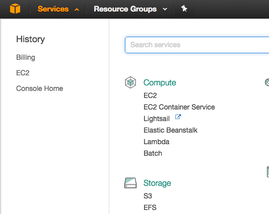
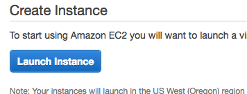
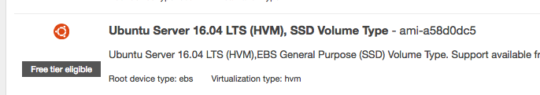

*Note that this guide uses Ubuntu as a Virtual Machine, you can use
other versions if you want.*

*Extra resources and docs for Shiny Server is here:
[*http://docs.rstudio.com/shiny-server/*](http://docs.rstudio.com/shiny-server/)*

*Also note that below is done using a Macbook so instructions may differ
for Windows.*

**AWS EC2 Instance with Ubuntu Setup:**

-   Sign up for AWS or login if you already have an account

-   Theres usually a button to create an EC2 instance on the main page,
    if not press Services on the navbar and then EC2 like below:

-   Click **Launch Instance**

-   Choose the Ubuntu Server:

-   Choose t2.micro for now to test out free tier, you can choose more
    > powerful versions if you can pay.

-   Launch the instance

-   Download the .pem key file

-   Open up your Terminal or something similar

-   Move to the folder/directory containing the .pem file

-   Use “ssh -i **keyFileName.pem**
    > [*ubuntu@ec2-etc-etc.compute.amazonaws.com*](mailto:ubuntu@ec2-etc-etc.compute.amazonaws.com)”
    
    and enter yes after successfully authenticating

**Shiny Server Setup:**

-   Enter “sudo apt-get install r-base”

-   Enter “sudo apt-get install gdebi-core”

-   Enter “sudo gdebi shiny-server-commercial-1.5.3.770-amd64.deb”

-   Enter yes to installing Shiny Server package and dependencies when
    prompted

**Shiny Server Start/Stop:**

-   Enter “sudo start shiny-server” to start your server

-   Enter “sudo stop shiny-server” to stop your server
